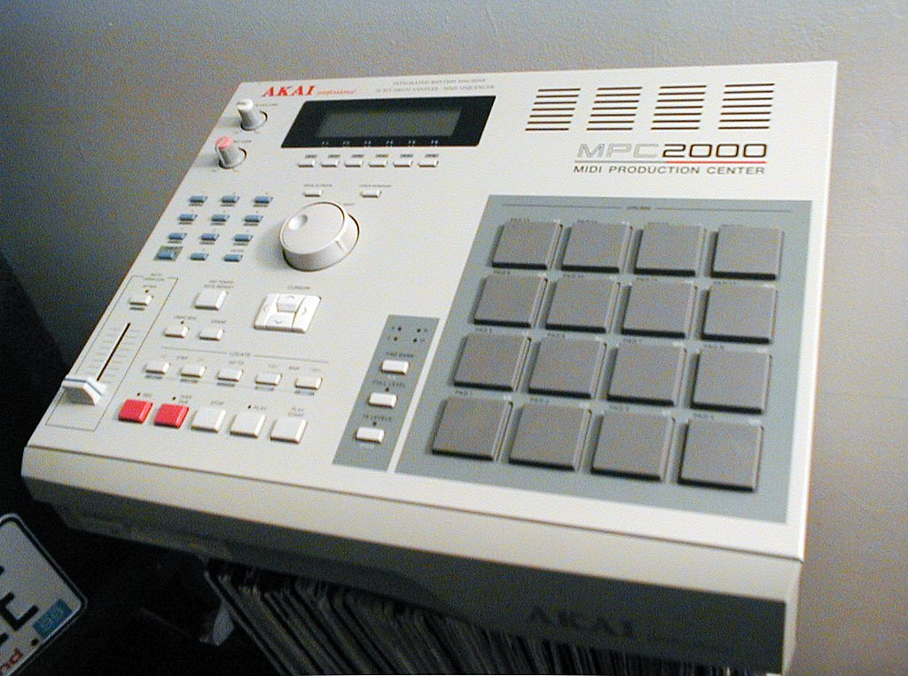
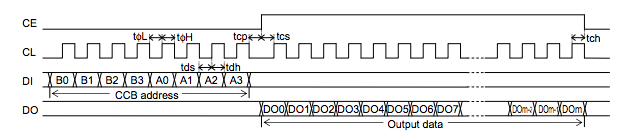

This hopefully the start of a repo that helps other Akai MPC 2000 users understand and fix their own MPC's.

### Hardware & Bill of Materials

### Schematics

### Boot Operations 

For the MPC to boot, a number of things need to be in place and to happen. The boot process needs the OS 1.72 disk to boot and uses the AMD Am27C256 256 Kilobit (32k x 8-bit) CMOS EEPROM for controlling the main board and also the top board functions. 

Todo: Dump the EEPROM 

### Protocols Used

The Akai seems to use the Sanyo Computer Control Bus (CCB) serial bus format to communicate between all ICs. The address is entered with CS low, then data with CS high

The new MPC stuff LCD has an adapter board which translates from Sanyo IC to SPI Bus. The original 240x64 T6963 LCD screen 

#### *Useful Resources*

[A useful Arduino library implementing the Sanyo CCB](https://github.com/RodLophus/SanyoCCB)
